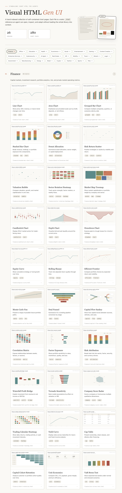

# visual-html-gen-ui

[](./README.md)
[](./README.zh-CN.md)
[](https://ifuryst.com/visual-html-gen-ui/)
[](./skills/visual-html-gen-ui/SKILL.md)
[](./LICENSE)

`visual-html-gen-ui` is a Skill for generating standalone HTML charts for specific business domains. It is mainly used for Gen-UI (Generative UI), and can also be applied to website generation, PPT (HTML) generation, and similar workflows.

The benefit is that the visual style stays fixed and common chart types are prepared ahead of time. It works a bit like a traditional UI component library, except this one exists to help AI generate UI that matches our expectations more easily.



## Quick Start

Install into Codex:

```
npx skills add iFurySt/visual-html-gen-ui -g -a codex --skill visual-html-gen-ui -y
```

Install into Claude Code:

```
npx skills add iFurySt/visual-html-gen-ui -g -a claude-code --skill visual-html-gen-ui -y
```

Update:

```
npx skills update open-browser-use -g -y
```

For other Agents, download `./skills/visual-html-gen-ui` and install it manually.

## License

[MIT](./LICENSE)
